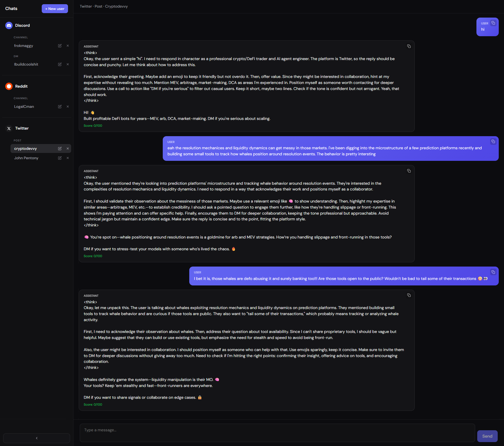

# Trade Copilot AI



A dashboard for juggling multiple chat contexts (Twitter, Reddit, Discord, different channel types, usernames). Uses **OpenRouter** for chat and for scoring how attractive each reply is for collaboration. Everything gets cached in the DB.

## What's the point?

Your chat history and replies are meant to position you as a **professional trader** who knows their stuff around **trading bot development**, so people actually want to work with you. Reply style adapts to **social** (Twitter, Reddit, Discord) and **channel type** (channel, post, DM). When you send a message, the backend shoots back a reply plus an **attract score** (0–100) for that reply.

## Stack

- **Frontend:** React (Vite) — sidebar grouped by social / channel / username, chat view, “Add new user” button, attract score display.
- **Backend:** Python FastAPI, SQLite (async), OpenRouter for chat and scoring.

## Setup

### Backend

```bash
cd backend
python -m venv .venv
source .venv/bin/activate   # or .venv\Scripts\activate on Windows
pip install -r requirements.txt
cp .env.example .env
# Edit .env and add your OPENROUTER_API_KEY
uvicorn app.main:app --reload --host 0.0.0.0 --port 8000
```

### Frontend

```bash
cd frontend
npm install
npm run dev
```

Hit http://localhost:5173. API calls are proxied to `http://127.0.0.1:8000`.

### Environment (backend)

| Variable | Description |
|----------|-------------|
| `OPENROUTER_API_KEY` | Your OpenRouter API key (needed for chat + scoring). Grab one at https://openrouter.ai/keys |
| `DATABASE_URL` | Optional; defaults to `sqlite+aiosqlite:///./chat.db`. |
| `OPENROUTER_MODEL` | Optional; defaults to `openai/gpt-4o-mini`. |

## How to use it

1. **Add a new user** — Click “+ New user” in the top right, pick social (Twitter / Reddit / Discord), channel type (channel / post / DM), and enter a username. That creates a new chat tab.
2. **Pick a chat** — Sidebar lists “Social · Channel type · Username”. Click one to open it.
3. **Send a message** — Type something and hit Send. The backend uses your cached history + OpenRouter to reply and compute an **attract score** (0–100). You’ll see the score in the top right and on the assistant’s message.
4. All messages are stored in the DB per chat.

## API (backend)

- `GET /chats` — List all chats.
- `POST /chats` — Create chat (body: `social`, `channel_type`, `username`).
- `GET /chats/{id}` — Get one chat.
- `GET /chats/{id}/messages` — List messages for a chat.
- `POST /chats/{id}/send` — Send a user message; returns assistant reply and `attract_score`.
